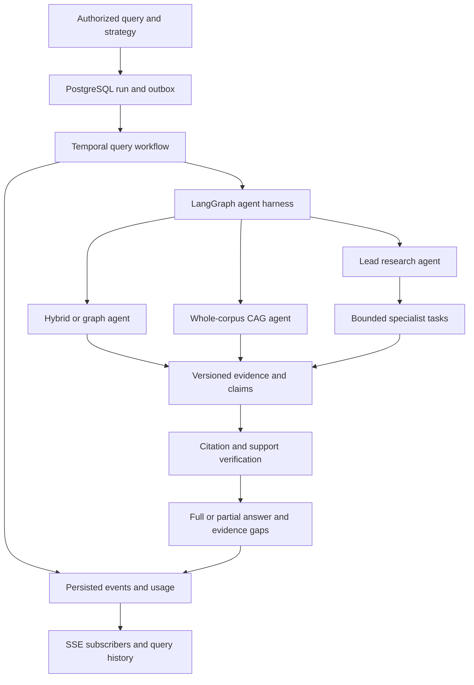

# FlintGraph roadmap

Updated: 2026-10-10. Inspected baseline: `1c15820` (Milestone 14).

Implementation has started: [Milestone 15 progress](milestones/15-useful-answers.md),
[Milestone 16 progress](milestones/16-evaluation-harness.md), and a
[fresh local quality report](reports/2026-10-10-local-answer-quality.md).
The inspection table below describes the original baseline, not current fixed
behavior. GitHub milestones 15–23 and their linked issues track remaining work.
Authoritative chunk packing has also started under
[Milestone 17](milestones/17-retrieval-and-evidence.md); native vector search remains pending.

This roadmap turns the current GraphRAG platform into a useful, measurable,
agent-driven product. Proposed features are not implemented merely because they
appear here. Each milestone needs passing acceptance criteria, linked GitHub
issues, and completed-behavior documentation under `docs/milestones/`.

## Outcomes and delivery order

Users should get useful cited answers about authorized documents, understand
evidence gaps, select several agent strategies, and trust that queries survive
disconnects and deployments. Small corpora should support reading every document;
larger corpora should support search and delegated research with explicit coverage.

First reproduce and fix answer failures. Then measure actual answer quality,
improve retrieval, introduce durable agent execution, add whole-corpus CAG and
lead-agent research, and qualify production operation. Preserve PostgreSQL as the
system of record, tenant isolation, staged extraction, deterministic graph
mutation, provenance, and offline tests throughout.

Assumptions: workspace documents are the initial knowledge boundary; local
Ollama and hosted providers remain supported. Hardware, workload, latency, and
spend targets require measurement before dates or throughput promises.

## Current implementation: evidence and gaps

| Area | Code inspected | Finding |
| --- | --- | --- |
| Providers | `config.py`, `infrastructure/answer_generator_factory.py`, `.env.example`, `compose.yaml` | Settings default to Anthropic outside tests, but Compose/example local configuration explicitly select deterministic answer/support providers. Show effective settings. |
| Embeddings | `application/embeddings.py`, `infrastructure/embedding_factory.py`, `infrastructure/db/models.py` | Deterministic, Ollama, and OpenAI-compatible adapters exist. PostgreSQL stores `ChunkEmbedding.vector` as JSON. |
| Vector search | `application/services/retrieval.py`, `vector_projection.py`, `api/routes/query.py` | Neo4j serves ANN search; pgvector and pgvectorscale are absent. Tenant filtering follows global ANN selection with bounded overfetch, so selective-tenant recall needs measurement. |
| Retrieval | `lexical_projection.py`, `retrieval.py` | OpenSearch provides lexical search; query graph neighborhoods are read from PostgreSQL. |
| Orchestration | `application/services/query_orchestration.py`, `query_planning.py`, `query_fusion.py` | Fixed LangGraph pipeline with parallel retrieval, not a configurable agent harness. Classifier/reranker provider settings lack corresponding runtime selection. |
| Context | `query_context_packing.py` | Candidate previews are packed with word-count token estimates. Whole-corpus reading and CAG are absent. |
| Verification | `application/query_faithfulness.py`, `application/services/query_faithfulness.py` | Citation repair/support/abstention exist. Rendering retains `partial` support claims; this differs from a fully supported answer covering only part of a question. |
| Streaming | `api/routes/query.py`, `query_answering.py`, `frontend/src/pages/AskPage.tsx` | Opening SSE starts queued execution; disconnect cancels work. Provisional deltas are recorded during generation but emitted after the answer node commits. |
| Evaluation | `evaluation/`, `evals/`, `.github/workflows/live-eval.yml` | Offline recorded gates exist. Live CI scores supplied recordings rather than capturing fresh application runs. |
| Operations | [Milestone 14](milestones/14-operational-readiness.md), `observability/`, `ops/observability/` | Traces, metrics, readiness, audit, and usage accounting exist. Retention, distributed limits, and proven recovery remain work. |

Paths above are relative to `src/flint_graph/` except explicitly named frontend,
configuration, and workflow paths. These are static inspection findings. The
exact cause of the user's unhelpful answers requires a failing run and its
effective configuration; this roadmap does not claim that diagnosis is complete.

## Architecture and alternatives

Improving the fixed pipeline is the quickest reliability step, but does not meet
whole-corpus/delegation requirements. Replacing the platform with a general agent
framework would introduce migration before proving answer quality. Recommended:
extend LangGraph with a bounded agent harness using existing retrieval,
PostgreSQL ledgers, provenance, and Temporal dispatch.

Every query strategy becomes an agent with common typed input/output and budget
contracts. Authorization, SQL, parsing, evidence validation, and state transitions
remain deterministic application services exposed through tools.

Temporal owns dispatch/retry/cancellation/recovery; LangGraph owns agent
decisions/resumable state; PostgreSQL owns runs/tasks/events/evidence/budgets.
Provider calls belong in activities, never replayed Temporal workflow code.
Persist completed outputs by task/step/attempt identity and document the crash
window before output persistence; exactly-once model billing is not guaranteed.

## Strategy and harness contracts

| Strategy | Behavior | Bounds and fallback |
| --- | --- | --- |
| `auto` | Routes using question, corpus size, readiness, permissions, and budget. | Persist choice/reason. Start with tested rules; validate model-proposed plans. |
| `hybrid` | Lexical/vector search, source-section reads, reranking, answering. | Default for focused questions; bounded rewrites/retries for sparse evidence. |
| `graph` | Entity linking, bounded traversal, original evidence reads. | Hybrid fallback when graph evidence is sparse; triples alone cannot certify facts. |
| `cag` | Reads every document in an enumerated authorized corpus snapshot; optionally reuses cached model context. | Entire corpus plus prompt/question/history/tool overhead/output reserve must fit. Explicit mode reports overflow; auto may select hybrid. |
| `research` | Lead agent decomposes, delegates, reconciles, and verifies synthesis. | Parent controls count/depth/concurrency/time/tokens/spend; no unrestricted recursive spawning. |

Tools: `list_documents`, `read_document`, `read_section`, `search_lexical`,
`search_vector`, `graph_neighborhood`, and capability-scoped `delegate_task`.
Return immutable source IDs, exact evidence locations, coverage, and structured
errors. External web search is a separate optional workspace capability after
document-only research works; snapshot/cite external evidence and enforce URL
policy. No unrestricted SQL, shell, or URL tools.

Inputs include a server-authorized workspace/principal, filters, corpus/index
snapshots, strategy/model/prompt/tool versions, and hard budgets. Outputs include
supported claims/evidence, answered/unanswered parts, conflicts, coverage, and
stopping reasons. Task records include parent IDs, dependencies, attempts, status,
usage, and errors. Record concise decisions/tool activity, not private reasoning.

## Milestones

| Milestone | Deliverable | Dependencies | Exit evidence |
| --- | --- | --- | --- |
| 15 | Useful answers and explainable failures | 14 | Regression cases, real-provider smoke, visible terminal states |
| 16 | Fresh end-to-end evaluation harness | 15 | Automated capture, expanded dataset, comparison reports |
| 17 | PostgreSQL vector search and stronger evidence packing | 16 | Migration/rollback rehearsal, measured filtered recall/latency |
| 18 | Durable query execution and common agent harness | 15, 16 | Restart/disconnect/concurrency/budget tests; bounded hybrid agent |
| 19 | Whole-corpus CAG and document reading | 18 | Complete coverage, capacity/cache invalidation tests |
| 20 | Lead-agent research and verified partial answers | 18, 19 | Delegation, coverage, budget, section-replay evaluations |
| 21 | Corpus and graph quality at scale | 16, 17 | Parser/extraction inspection and incremental rebuild evidence |
| 22 | Production scale, security, and recovery | 17, 18, 20 | Load/isolation/interruption/restore drills |
| 23 | Release qualification and rollout | 19, 20, 21, 22 | Release report, operator rehearsal, canary/rollback |

Milestone 18 can progress alongside 17. Ship/evaluate each strategy separately;
reliability fixes do not wait for the entire roadmap.

### 15: useful answers and explainable failures

- Reproduce with a small factual document, an answerable question, a no-answer
  question, and reported failures when available. Capture effective providers,
  document/index/coverage, candidates, packed evidence, parsing/citation/support
  decisions, safe error codes, and final events.
- Distinguish missing index, pending/failed coverage, empty retrieval, provider
  auth/network/model/schema errors, abstention, and cancellation. Show actionable
  UI messages and run IDs; sanitize sensitive provider errors.
- Surface effective providers in setup/readiness and align local profiles.
  Verify hosted model availability rather than trusting hardcoded model IDs.
- Add regression tests before fixes. Audit parallel retrievers sharing an
  `AsyncSession`; isolate sessions or serialize DB access while retaining
  independent network concurrency.
- Propagate accepted document filters through every retriever and context read;
  storing filters in metadata alone does not implement them.
- Validate structured claims, use bounded schema repair, and separate generation
  from support-checker errors. Retain support checks rather than increasing
  answer rate by weakening verification.
- Omit or narrow/recheck partially supported factual clauses. Preserve supported
  facts and explain missing evidence; full question-coverage handling is M20.
- Measure streaming commit/emit behavior and show immediate progress. Specify
  incremental-event replay semantics before changing delivery.

Acceptance: useful cited answers for answerable regressions; explicit reasons for
abstention/failure/cancellation; document filters and tenant isolation pass;
offline tests make no provider calls. Record real-provider upload-to-answer smoke
separately; deterministic success alone does not prove real answer quality.

### 16: evaluate the running application

- Capture fresh runs through public APIs: ingest fixed corpus, await readiness,
  query, record events/evidence/answers/timing/usage. Record corpus hashes,
  provider/prompt versions and revision; stale recordings cannot qualify releases.
- Add paraphrases, identifiers, multi-document/multi-hop questions, whole-corpus
  summaries, tables, conflicting dates, partial/no-answer cases, Indonesian and
  English content, deletion, filters, and foreign-workspace adversarial cases.
- Measure recall/MRR, correctness, citation validity, support, false abstention,
  coverage, first verified output, latency, and cost. Human-review samples;
  overlap scores and model judges alone cannot prove correctness.
- Preserve offline PR gates; add opt-in local/hosted captures and an explicitly
  budgeted fresh live gate. Compare strategies on identical authorized snapshots.

Acceptance: real application changes affect captures; fixture scoring and live
execution are distinct; reports reproduce failures; thresholds/baselines are
reviewed; offline CI never calls paid providers or silently updates baselines.

### 17: native vector retrieval and evidence packing

Add pgvector first; retain Neo4j vector search for measured comparison/rollback.
pgvector supplies native vector types and exact/HNSW/IVFFlat search.
pgvectorscale complements pgvector with StreamingDiskANN; it is an optional index
extension, not an embedding model. Consult [pgvector](https://github.com/pgvector/pgvector)
and [pgvectorscale](https://github.com/timescale/pgvectorscale).

- Add a vector-search adapter, backend/index settings, extension readiness, typed
  vectors, and JSON-ledger migration. Validate finite values, dimensions,
  model/config/chunk hashes and counts; use dimension-compatible indexes.
- Retain JSON during cutover, backfill idempotently, shadow-compare reads, and
  activate only after gates. Backend changes may reuse embeddings; model changes
  require re-embedding. Rehearse rollback before removing old storage.
- Apply workspace/active-document/version/requested filters in SQL. Measure ANN
  against exact search for selective tenants; tune scan budgets/partitioning.
- Benchmark Neo4j, exact pgvector, HNSW, and optional pgvectorscale at 10k/100k/1m
  chunks as resources permit. Record hardware/dimensions/tenant distributions,
  recall, p50/p95, concurrency, build/memory/storage/update/delete costs.
  Extension/image/managed-host availability gates pgvectorscale adoption.
- Load full authorized sections, bounded adjacent chunks, exact evidence, and
  model-aware token accounting or a documented conservative approximation.
  Evaluate reranking/diversity and preserve exact identifiers.

Acceptance: no foreign/deleted results; filtered ANN recall measured against exact
search; compatible vectors enforced; quality/cutover/rollback/restore pass. Record
backend choice in an ADR; faster ANN cannot fix poor parsing or embeddings.

### 18: durable agent execution

- Transactionally dispatch query runs through outbox/Temporal. SSE subscribes;
  disconnect does not cancel execution. Add explicit cancellation and cursor
  replay; prevent multiple subscribers executing the same run.
- Add a versioned strategy registry, typed tools, capability allowlists, validated
  agent actions and deterministic test agents. Begin with bounded hybrid; wire
  or remove nonfunctional classifier/reranker provider settings.
- Persist steps and completed outputs, reconcile abandoned leases, and isolate
  parallel DB sessions. Integrate checkpoints with run/attempt identity.
- Enforce parent-wide time/steps/tools/retries/tokens/cost reservations before
  dispatch; children/retries consume that budget. Unknown paid-model cost needs
  explicit policy rather than counting as zero.
- Extend current traces/metrics/usage/audit with strategy/task context; retain
  low-cardinality metrics, redaction, and documented retention.

LangGraph saved state is a building block, not an automatic exactly-once
guarantee: [persistence documentation](https://docs.langchain.com/oss/python/langgraph/persistence).
Acceptance: API/worker restarts and disconnects preserve runs; ordered replay,
single execution ownership, cancellation and exhaustion work; all facts retain
provenance/support checks.

### 19: whole-corpus CAG

The [CAG paper](https://arxiv.org/abs/2412.15605) describes preloading knowledge
and reusing context/cache. Here, whole-corpus means every document in the selected
authorized corpus, not all search hits.

- Enumerate immutable active-version manifests with complete pagination. Parsed
  document reads must work without embedding projections when content exists.
- Build complete citation-bearing context including headings/tables/locations;
  account for the actual model window and reserves. Never truncate silently and
  claim complete coverage. Return explicit overflow for forced CAG.
- Key caches by workspace, authorization revision/scope, corpus/version hashes,
  parser/context schema, model, prompt. Distinguish serialized-context caches
  from provider prompt/KV caches; uncached full-context mode remains valid.
- Invalidate on ingestion/activation/deletion/ACL/membership changes; reauthorize
  reads/cache use/result delivery. Define TTL/eviction/retention/deletion policy.
- Offer partitioned document research when too large; track read coverage and
  drill back to original evidence. Summary hierarchies are lossy.

Acceptance: every selected document appears in coverage; no unread source is
reported read; overflow, cache hits, invalidation/revocation and citations pass;
compare correctness/latency/cost against hybrid on the same corpus.

### 20: lead-agent research and partial answers

- Validate subquestion/dependency plans; delegate to document/search/graph
  specialists. Initial maximums: depth 1, four children, concurrency two, subject
  to stricter server/workspace budgets.
- Specialists return evidence/claims/coverage/uncertainty/errors. Deduplicate
  work/citations and atomically reserve parent budgets. Lead reconciles conflicts
  and dates, checks coverage, and schedules bounded follow-ups.
- Keep execution states separate from answer completeness. Version answer
  metadata for `complete`, `partial`, `insufficient_evidence`, answered/unanswered
  parts and stopping reasons; preserve existing run-state compatibility.
- Stream verified sections with stable IDs/revisions/task IDs/provenance. Draft
  tokens are explicitly provisional/replaceable. Partial answers contain only
  supported facts and identify missing scope. Partially supported claims must
  be narrowed/rechecked or omitted.
- UI shows strategy/progress/coverage, verified sections, evidence gaps, and
  expandable tasks/citations. Failure/cancellation may preserve verified output
  with explicit incomplete status; conflicting/stale sections cannot be final.

Acceptance: mixed-success tasks yield useful cited partial answers; no evidence
abstains; conflicts remain visible; budgets/cancellation reach children; section
replay is deterministic; quality gain justifies additional latency/cost.

### 21: corpus and graph quality

- Evaluate scans/OCR, tables, complex PDFs, DOCX and HTML; new formats require
  page/section provenance and fixtures. Diagnose empty/sparse/noisy content.
- Add extraction inspection APIs/UI for evidence rejection/invocations/proposals,
  graph coverage and correction/reprocessing. Preserve staged verification.
- Add provenance-bearing section/document/community summaries for broad questions;
  original evidence remains the factual source.
- Evaluate incremental graph projections against full rebuilds. Version churn
  and deletion invalidate vectors/summaries/CAG caches/pending agent reads.

Acceptance: difficult formats have evidence regressions; sparse content is
visible; reingestion repeats safely; incremental/full rebuilds agree; deleted or
superseded content cannot reach new answers.

### 22: scale, security and recovery

- Define supported pinned deployment images/extensions/models, production Temporal,
  TLS/private networks, secret rotation and capability checks.
- Implement shared limiting/quotas, fair queues, concurrency/pool sizing,
  backpressure, distributed budgets; test outages and retry storms.
- Treat documents/model/tool outputs as untrusted. Test injection, forged
  citations/actions, cross-workspace delegation/cache access, mid-run revocation,
  and optional web-tool SSRF. Audit capabilities and policy changes.
- Set retention/redaction for events/checkpoints/caches/usage/audit; define
  historical provenance visibility after deletion or revocation.
- Automate consistent PostgreSQL/object-store backup/restore; include workflow
  recovery/reconciliation, extension versions and index/model settings. Rebuild
  projections and run post-restore answer/provenance smoke.
- Derive SLOs from load/interruption tests: useful answer rate, p95/errors/lag,
  first verified output and freshness. Connect existing alerts to operator actions.

Acceptance: replicas share quotas; outages terminate/degrade explicitly; restore
meets recorded RPO/RTO; injection cannot expand permissions; security/deletion
tests cover every strategy; operators recover stalled work without DB edits.

### 23: release qualification

- Publish fresh quality/load/cost/restore reports with versioned corpus, hardware,
  providers, limitations and rollback instructions.
- Gate release on migrations/isolation/support/citations, reviewed answerability,
  and fresh captures, with existing offline gates first.
- Canary strategies/models/prompts/indexes/tools per workspace behind flags;
  preserve run snapshots and rehearse rollback without blocking safe reads.
- Rehearse login/workspace/provider/upload/readiness/ask/citations/CAG/research/
  deletion/restore onboarding using documented local and hosted profiles.

Acceptance: new operators deploy/recover using runbooks; new users obtain useful
cited answers; rollout/rollback is proven; no unexplained quality regression.

## Platform and developer-experience tracks

These tracks run alongside product milestones 15–23; their numbers are not a
requirement to wait until M23. M14 observability is the baseline, not a blank slate.

| Track | Milestone | Outcome | Dependencies |
| --- | --- | --- | --- |
| Platform | [24: observability](milestones/24-platform-observability.md) | Phoenix, provisioned Grafana, Alertmanager, privacy-safe traces, evaluated ELK/logging and production telemetry | 14; coordinate 18/22 |
| Platform | [25: search/inference](milestones/25-search-inference-platform.md) | Measured large-corpus retrieval and optional vLLM serving | 16/17; coordinate 21/22 |
| Developer experience | [26: reproducible environments](milestones/26-developer-experience.md) | Doctor, explicit local profiles, native infra validation, pinned upgrades and debug handoff | 15; coordinate 16/24 |

[ADR 0013](adr/0013-layered-platform-observability.md) keeps OpenTelemetry as the
common boundary: Phoenix inspects AI traces, Grafana displays operational metrics,
and Prometheus plus Alertmanager handles incidents. OpenLLMetry needs explicit
content-capture disabling and duplicate-span evaluation. Email notification stays
disabled until an operator supplies destination/SMTP configuration.

ELK is tracked as an explicit logging-backend evaluation against OpenSearch
observability and existing Loki. Do not add a duplicate cluster or confuse log
search with tenant corpus retrieval. [ADR 0014](adr/0014-measured-search-and-inference-platform.md)
retains Ollama locally and gates optional vLLM adoption on real quality/capacity
benchmarks. [ADR 0015](adr/0015-reproducible-developer-experience.md) defines safe,
read-only diagnostics before bootstrap automation. Proposed tools are not
implemented merely because they are named here.

## GitHub implementation queue

- [Milestone 15: useful answers and explainable failures](https://github.com/mohripan/flint-graph/issues/1)
- [Milestone 16: evaluate the running application](https://github.com/mohripan/flint-graph/issues/2)
- [Milestone 17: native vector retrieval and evidence packing](https://github.com/mohripan/flint-graph/issues/3)
- [Milestone 18: durable agent execution](https://github.com/mohripan/flint-graph/issues/4)
- [Milestone 19: whole-corpus CAG](https://github.com/mohripan/flint-graph/issues/5)
- [Milestone 20: lead-agent research and partial answers](https://github.com/mohripan/flint-graph/issues/6)
- [Milestone 21: corpus and graph quality](https://github.com/mohripan/flint-graph/issues/7)
- [Milestone 22: scale, security and recovery](https://github.com/mohripan/flint-graph/issues/8)
- [Milestone 23: release qualification](https://github.com/mohripan/flint-graph/issues/9)
- [Milestone 24: platform observability and incident response](https://github.com/mohripan/flint-graph/issues/34)
- [Milestone 25: search and inference platform performance](https://github.com/mohripan/flint-graph/issues/35)
- [Milestone 26: developer experience and reproducible environments](https://github.com/mohripan/flint-graph/issues/36)

Create milestone-tracking issues plus focused implementation issues carrying the
observed problem, dependencies, acceptance tests and documentation scope. Link
them below as created. Work sequentially on eligible issues; use separate commits
with issue references and no co-author trailers. Direct commits use the existing
default branch (`master`); dependent PRs are an alternative if protection requires
review. Close issues only after criteria pass and link delivered commits.

For every behavior change, add meaningful tests first, preserve unrelated work,
run focused and required wider gates, and document delivered limitations.
Required backend gates: `uv run pytest`, `uv run ruff check .`, `uv run mypy`,
the deterministic eval command in `AGENTS.md`, `uv run alembic upgrade head --sql`,
and `docker compose config`. Frontend changes also need `npm run typecheck`,
`npm run build`, and browser checks. Native vector/durability/cache/distributed
budget acceptance requires real services; SQLite/offline fixtures alone cannot
prove it. Report commands passed, failed and skipped explicitly.

## Evidence needed for later decisions

User-requested live/black-box verification and business/financial corpora are
tracked in [#53: fresh nightly quality tests](https://github.com/mohripan/flint-graph/issues/53)
and [#54: pinned public financial corpus](https://github.com/mohripan/flint-graph/issues/54).
Use independently annotated questions/evidence, keep answers out of ingested
documents, and distinguish real model-quality results from fixture/health checks.
Every implemented slice should include relevant live verification, with missing
services, credentials, models, budgets and skipped checks reported explicitly.

Actual failing runs/effective deployment; corpus size/languages/formats/churn;
hardware/concurrency/spend; embedding/chunking choices; filtered ANN benchmarks;
strategy quality/cost/latency thresholds; provider cache support; recovery and
historical deletion policy; external search/connectors after document research.
Resolve these through measurements and reviewed ADRs, not smoke-fixture guesses.
